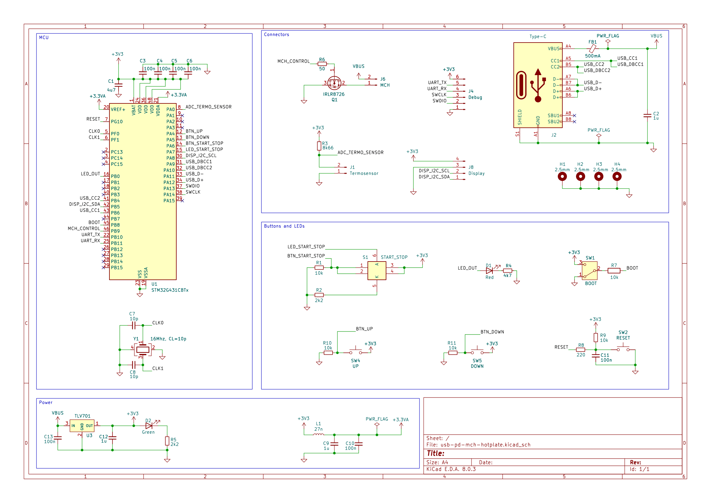
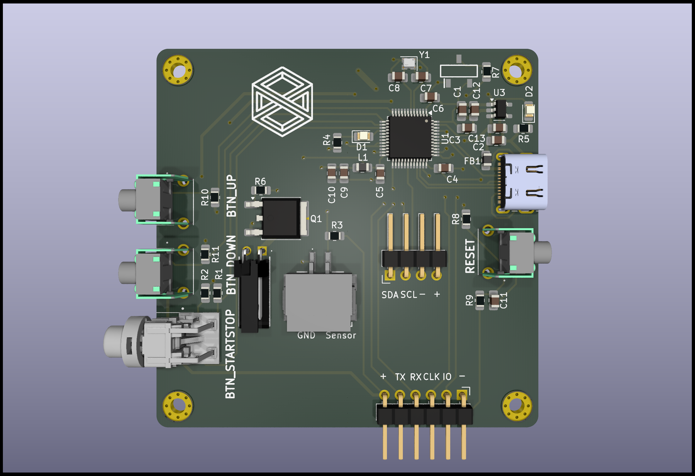
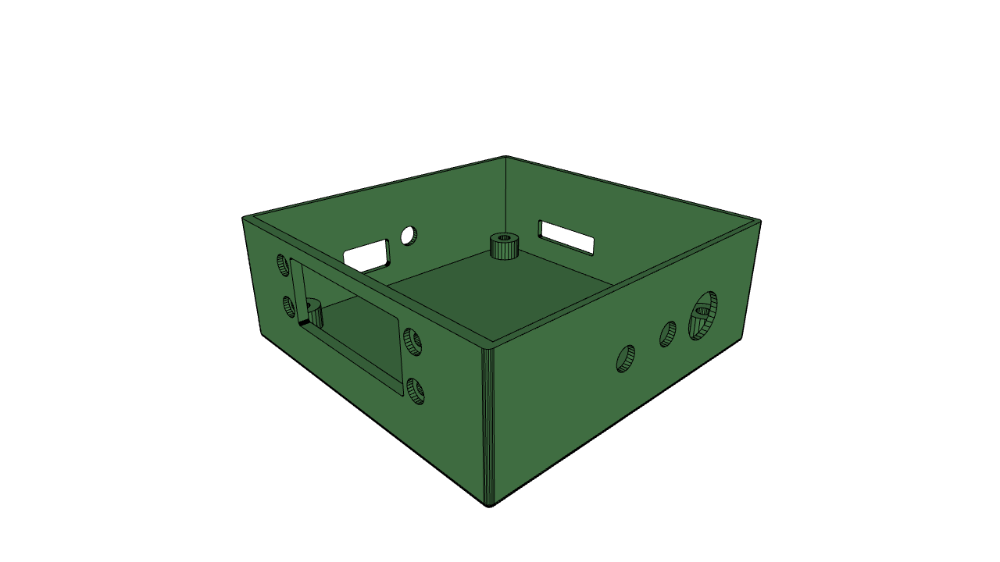
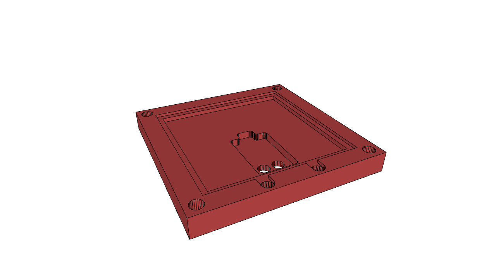

# USB-powered hot plate

## Board

Schematics in [pdf format](./pcb/usb-pd-mch-hotplate.pdf)

Archive with gerber files and drill locations could be found [here](./pcb/manufacturing/manufacturing.zip)

Bill of material in [CSV format](./pcb/usb-pd-mch-hotplate.csv)

|Reference              |Value        |Mouser Part Number  |Qty|DNP|
|-----------------------|-------------|--------------------|---|---|
|C1                     |4u7          |187-CL21A475KPFNNNF |1  |   |
|C2                     |1u           |187-CL21B105MBFNNNE |1  |   |
|C3,C4,C5,C6,C10,C11,C13|100n         |187-CL21B104KACNNND |7  |   |
|C7,C8                  |10p          |603-CC805JRNPO9BN100|2  |   |
|C9,C12                 |1u           |187-CL21B105KPFNNNE |2  |   |
|D1                     |Red          |710-150080RS75000   |1  |   |
|D2                     |Green        |710-150080GS75000   |1  |   |
|FB1                    |500mA        |652-MH2029-301Y     |1  |   |
|J1                     |Termosensor  |305-234832          |1  |   |
|J2                     |Type-C       |656-DX07S016JA1R1500|1  |   |
|J4                     |Debug        |649-1012937990604BLF|1  |   |
|J6                     |MCH          |710-66100211722     |1  |   |
|J8                     |Display      |649-10027011-404HLF |1  |   |
|L1                     |27n          |652-CE201210-27NJ   |1  |   |
|Q1                     |IRLR8726     |942-IRLR8726TRPBF   |1  |   |
|R1,R7,R9,R10,R11       |10k          |603-RC0805FR-1010KL |5  |   |
|R2,R5                  |2k2          |603-RC0805FR-072K2L |2  |   |
|R3                     |8k66         |603-AC0805JR-073K3L |1  |   |
|R4                     |4k7          |603-RC0805FR-074K7P |1  |   |
|R6                     |50           |603-AC0805FR-07100RL|1  |   |
|R8                     |220          |603-RT0805FRE07220RL|1  |   |
|S1                     |START_STOP   |612-TL1250F180GQRCLR|1  |   |
|SW1                    |BOOT         |611-TDD01H0SB1R     |1  |   |
|SW2                    |RESET        |611-PTS645VH312     |1  |   |
|SW4                    |UP           |611-PTS645VL582     |1  |   |
|SW5                    |DOWN         |611-PTS645VL582     |1  |   |
|U1                     |STM32G431CBTx| 511-STM32G431CBT6  |1  |   |
|U3                     |TLV701       |595-TLV70133DBVRM3  |1  |   |
|Y1                     |16Mhz, CL=10p|81-XRCGB16M000FXN02R|1  |   |

## Assembly

### Chassis

Step file for [board case](./chassis/PCB chassis.STEP)

Step file for [MCH holder](./chassis/MCH holder.STEP). Please note that it's better to adjust model for exact dimensions of MCH plate (plus some tolerance).

### Hardware and extra parts

- MCH itself, 50x50x2mm, up to 24V, 150W
- steel washers, M2x5, 0.2mm thick, 8 pcs
- ceramic fiber paper
- brass inserts, M2xL4xOD3, 4 pcs
- steel standoffs, M2xL25, 4 pcs
- bolts for MCH holder mount, M2xL6xOD4, 4pcs
- NTC 100k thermistor, 	871-B57703M1104A002
- display, DFRobot DFR0647
- bolts for display mount, 144-04M020040HN, 4pcs
- nuts for display mount, 144-50M020040F004, 4pcs
- thermosensor connector, 305-364198
- thermosensor connector terminals, 305-464766 2pcs
- MCH element connector, 710-661002151922
- display connectors, 649-65039-033ELF, 2pcs
- display connector terminals, 649-47217-000LF, 8pcs
- kapton tape
- high temperature silicone sealant, K2 B205N

### Assembly steps

1. Install heat set inserts into PCB chassis
2. Place PCB inside chassis
3. Put washers from ceramic fiber paper at the mounting holes
4. Put steel washers above ceramic fiber paper washers
5. Screw standoffs to chassis mounting holes
6. Install display to the display slot by using 4 bolts and 4 nuts
7. Connect display to the board by using 4-pin cable
8. Glue thermo sensor to the MCH element
9. Better isolate MCH wires to avoid electrical contact with MCH holder
10. Place MCH plate into MCH holder and route wires from thermo sensor and MCH element itself through corresponding holes
11. Crimp connectors to thermo sensor and MCH element wires
12. Connect thermo sensor and MCH element to the female connectors on the board
13. Put steel washers to the upper part of standoffs 
14. Put washers from ceramic fiber paper above steel washers
15. Place MCH holder to standoffs and screw it

## Firmware

There is compiled [hex file](./firmware/bin/usb-pd-mch-hotplate.hex) in repository, that could be flashed to PCB.

Make sure that `BOOT` switch lever shifted in direction of logo and connect the board via USB and use stm32 programming software. I am using stm32programmer.

## Software

Make sure that `BOOT` switch lever shifted in direction to near board edge and connect the board via USB to USB PD 3.0 compatible power supply that can output at least 100W of power. 

Green LED should be lighting and red LED should be flashing.

Display should show initial menu with the list of programs.